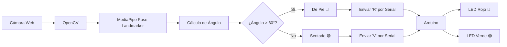

# Pose-Detection-Mediapipe-Test

# integrantes: Wilson Andres Arenas Diaz, Jhoan Sebastian Montanez Alvis, Andres Feliep Garcia Del Rio


Detección de postura (de pie/sentado) con MediaPipe y control de LEDs con Arduino


<div align="center">
  <h1>🕺 Detección de Postura 🤸‍♂️</h1>
  <h3>MediaPipe Pose Landmarker + Arduino</h3>
  <p><i>¿De pie o sentado? Tu cámara lo sabe y controla LEDs</i></p>
  
  
  
  
  
  
</div>

---

## 📸 **DEMOSTRACIÓN EN VIVO**


<div align="center">
  <table>
    <tr>
      <td align="center">
        
        <br><b>🟥 De Pie</b>
      </td>
      <td align="center">
        
        <br><b>🟩 Sentado</b>
      </td>
    </tr>
  </table>
  <p><i>La etiqueta cambia de color según la postura detectada</i></p>
</div>

---

## 🎯 **DESCRIPCIÓN DEL PROYECTO**

Este proyecto utiliza **visión por computadora** para detectar en tiempo real si una persona está **de pie** o **sentada**. La postura identificada se muestra en pantalla con una etiqueta de color y, mediante comunicación serial, se envían comandos a un **Arduino** que controla LEDs:

- 🔴 **LED Rojo** → Persona de pie
- 🟢 **LED Verde** → Persona sentada
- ⚫ **Ambos apagados** → Sin persona detectada

> ⚠️ **Nota:** El código incluye un modo simulación para probar sin Arduino físico.

---

## 🏗️ **ARQUITECTURA DEL SISTEMA**



## Codigo

### Arduino
```
const int LED_ROJO = 13;
const int LED_VERDE = 12;
char comando;

void setup() {
  pinMode(LED_ROJO, OUTPUT);
  pinMode(LED_VERDE, OUTPUT);
  digitalWrite(LED_ROJO, LOW);
  digitalWrite(LED_VERDE, LOW);
  Serial.begin(9600);
  Serial.println("Arduino listo");
}

void loop() {
  if (Serial.available() > 0) {
    comando = Serial.read();
    switch(comando) {
      case 'R':
        digitalWrite(LED_ROJO, HIGH);
        digitalWrite(LED_VERDE, LOW);
        Serial.println("LED ROJO - De Pie");
        break;
      case 'V':
        digitalWrite(LED_ROJO, LOW);
        digitalWrite(LED_VERDE, HIGH);
        Serial.println("LED VERDE - Sentado");
        break;
      case 'A':
        digitalWrite(LED_ROJO, LOW);
        digitalWrite(LED_VERDE, LOW);
        Serial.println("LEDs apagados");
        break;
    }
  }
}

```

### Python

```

import cv2
import mediapipe as mp
from mediapipe.tasks import python
from mediapipe.tasks.python import vision
import numpy as np
import time
import os

print("=== INICIO DEL PROGRAMA ===")
print(f"Carpeta actual: {os.getcwd()}")

estado = "Iniciando..."
arduino = None  # Modo simulación (sin Arduino físico)

def detectar_postura(result, output_image, timestamp_ms):
    global estado
    if result.pose_landmarks:
        landmarks = result.pose_landmarks[0]
        
        # Puntos de hombros (11, 12) y caderas (23, 24)
        hombro_izq = landmarks[11]
        hombro_der = landmarks[12]
        cadera_izq = landmarks[23]
        cadera_der = landmarks[24]
        
        # Puntos medios para mayor precisión
        hombro_medio_x = (hombro_izq.x + hombro_der.x) / 2
        hombro_medio_y = (hombro_izq.y + hombro_der.y) / 2
        cadera_media_x = (cadera_izq.x + cadera_der.x) / 2
        cadera_media_y = (cadera_izq.y + cadera_der.y) / 2
        
        # Vector del torso (de cadera a hombro)
        vector_x = hombro_medio_x - cadera_media_x
        vector_y = hombro_medio_y - cadera_media_y
        
        longitud = np.sqrt(vector_x**2 + vector_y**2)
        if longitud > 0:
            # Calcular ángulo con la vertical (0, -1)
            cos_angulo = (vector_x * 0 + vector_y * (-1)) / longitud
            cos_angulo = np.clip(cos_angulo, -1.0, 1.0)
            angulo = np.degrees(np.arccos(cos_angulo))
            
            # UMBRAL: puedes ajustarlo entre 50 y 70 según necesites
            UMBRAL = 70
            if angulo > UMBRAL:
                estado = "De Pie"
                comando = 'R'
            else:
                estado = "Sentado"
                comando = 'V'
            
            # Mostrar en consola (simulación de envío a Arduino)
            print(f"✅ {estado} - Ángulo: {angulo:.1f}° | Comando: {comando} (simulado)")
    else:
        estado = "Sin persona"

def main():
    global estado
    print("1. Configurando detector...")
    
    # Ruta del modelo (debe estar en la carpeta models)
    model_path = "models/pose_landmarker_full.task"
    if not os.path.exists(model_path):
        print(f"❌ ERROR: No se encuentra el modelo en: {model_path}")
        print("   Descárgalo desde:")
        print("   https://storage.googleapis.com/mediapipe-models/pose_landmarker/pose_landmarker_full/float16/1/pose_landmarker_full.task")
        print("   Y colócalo en la carpeta 'models/'")
        return
    
    print("2. Modelo encontrado, configurando opciones...")
    
    # Configurar MediaPipe
    base_options = python.BaseOptions(model_asset_path=model_path)
    options = vision.PoseLandmarkerOptions(
        base_options=base_options,
        running_mode=vision.RunningMode.LIVE_STREAM,
        result_callback=detectar_postura
    )
    
    print("3. Creando detector...")
    detector = vision.PoseLandmarker.create_from_options(options)
    
    print("4. Abriendo cámara...")
    cap = cv2.VideoCapture(0)
    
    if not cap.isOpened():
        print("❌ ERROR: No se pudo abrir la cámara")
        return
    
    print("✅ Cámara abierta correctamente")
    print("5. Iniciando bucle principal - Presiona 'q' para salir")
    print("\n" + "="*50)
    print("INSTRUCCIONES:")
    print("- Párate frente a la cámara")
    print("- Siéntate para ver el cambio")
    print("- Los comandos simulados aparecen en la terminal")
    print("="*50 + "\n")
    
    start_time = time.time()
    
    while True:
        ret, frame = cap.read()
        if not ret:
            print("❌ Error leyendo frame")
            break
        
        timestamp = int((time.time() - start_time) * 1000)
        rgb = cv2.cvtColor(frame, cv2.COLOR_BGR2RGB)
        mp_image = mp.Image(image_format=mp.ImageFormat.SRGB, data=rgb)
        
        detector.detect_async(mp_image, timestamp)
        
        # Dibujar en pantalla
        cv2.rectangle(frame, (10, 10), (400, 80), (0, 0, 0), -1)
        if estado == "De Pie":
            color_texto = (255, 0, 0)  # Rojo
        elif estado == "Sentado":
            color_texto = (255,255,0)  # Verde
        else:
            color_texto = (255, 255, 255)  # Blanco
        
        cv2.putText(frame, f"Estado: {estado}", (20, 45),
                   cv2.FONT_HERSHEY_SIMPLEX, 1, color_texto, 2)
        cv2.putText(frame, "Modo simulación (sin Arduino)", (20, 75),
                   cv2.FONT_HERSHEY_SIMPLEX, 0.5, (255, 255, 255), 1)
        cv2.putText(frame, "Presiona 'q' para salir", (10, frame.shape[0]-10),
                   cv2.FONT_HERSHEY_SIMPLEX, 0.5, (255, 255, 255), 1)
        
        cv2.imshow('Deteccion de Postura', frame)
        
        if cv2.waitKey(1) & 0xFF == ord('q'):
            print("🛑 Tecla 'q' presionada, saliendo...")
            break
    
    cap.release()
    cv2.destroyAllWindows()
    print("👋 Programa finalizado")

if __name__ == "__main__":
    main()

```

